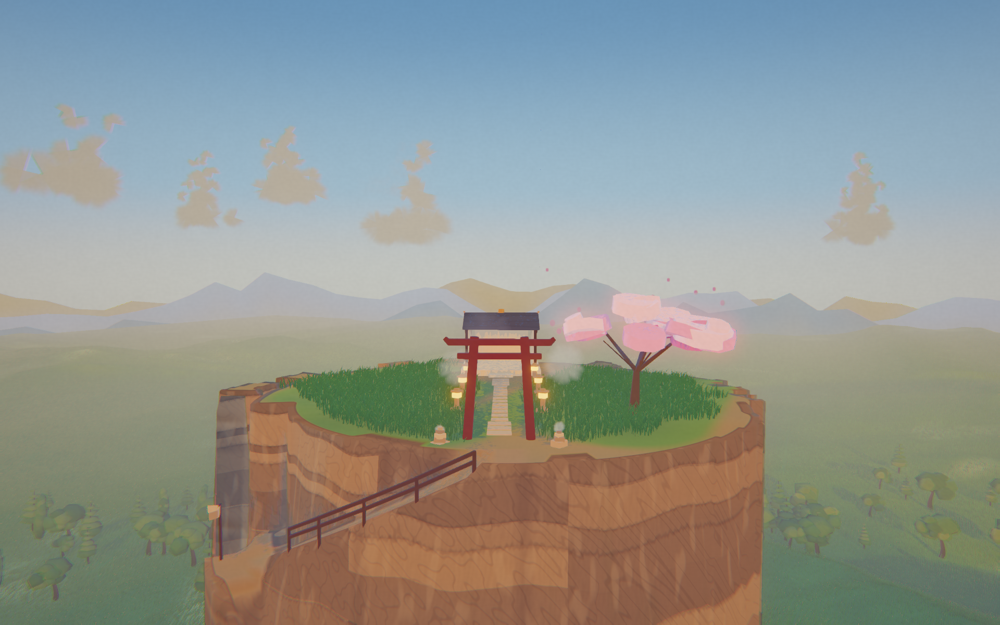
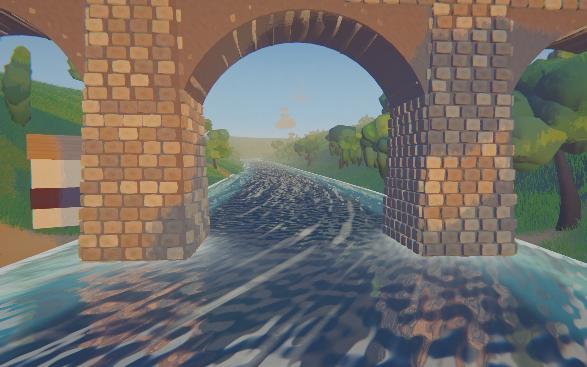

# Hoshi

A quiet valley to fly and explore.

**[▶ Play now](https://atominnovationth.github.io/Hoshi/)** — be flying in 10 seconds.

- Press **spacebar** and your feet leave the grass.
- Wander around with the mouse or the arrow keys.
- Soar, swoop, dive thru Torii, land on trees...
- Ride ridge lift, thermal to cloudbase...

A fork of a lovely valley by [lentils801](https://codepen.io/editor/lentils801/pen/019f9b4b-10d7-7f77-817f-f4eb83fdb289) — already worth a walk, now more fun to fly.

[MIT](LICENSE) · [Credits](CREDITS.md)
